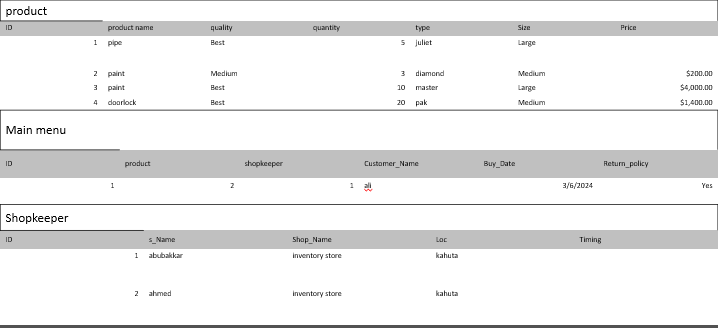

# Shop Management System

A comprehensive, user-friendly shop management solution designed for small to medium-sized businesses. This system streamlines invoicing, inventory management, and customer relationship management in one centralized platform.

## 🚀 Features

### 📊 **Invoicing**
- Generate professional invoices with customizable templates
- Track payments and manage outstanding balances
- Automated tax calculations
- Payment history and reporting

### 📦 **Inventory Management**
- Real-time stock level monitoring
- Easy product addition and removal
- Automated low-stock alerts
- Purchase order generation
- Supplier management

### 👥 **Customer Management**
- Comprehensive customer database
- Order history tracking
- Contact detail management
- Personalized service capabilities
- Customer analytics and insights

### 🏪 **Shop Management**
- Shop location and details configuration
- Shopkeeper profile management
- User role and permission management
- Business reporting and analytics

###  Run

## 🎯 Usage

### Getting Started

 **Product Management**
   - Navigate to Inventory → Add Product
   - Enter product details and initial stock quantity
   - Set up low-stock alerts

 **Customer Management**
   - Go to Customers → Add Customer
   - Enter customer information and contact details
   - Track customer purchase history

**Invoice Generation**
   - Select customer from database
   - Add products to invoice
   - Generate and print/send invoice

### User Roles

#### **Shopkeeper/Administrator**
- Full system access
- Customer and product management
- Invoice generation and reporting
- System configuration

#### **Shop Employee**
- Limited access to operational features
- Invoice creation
- Inventory updates
- Customer service functions

## 🖼️ Screenshots

### Shop MAnagement System

### TAbles

### Dashboard

### Main Menu

### MAin Menu Report

## 👥 Authors

- **Your Name** - Aubakkar -
- **Github** -[(https://github.com/AbubakarZubair)]-
- **Email** -[abubakarkhan17110@gmail.com]-

## 🙏 Acknowledgments

- Thanks to all contributors who helped build this system
- Inspired by modern retail management needs
- Built with ❤️ for small and medium businesses

## 🐛 Bug Reports

If you encounter any bugs, please report them by:
1. Creating an issue on GitHub
2. Providing detailed error descriptions
3. Including steps to reproduce
4. Attaching relevant screenshots

## 🔄 Changelog

## 🌟 Show Your Support

Give a ⭐️ if this project helped you!

---
